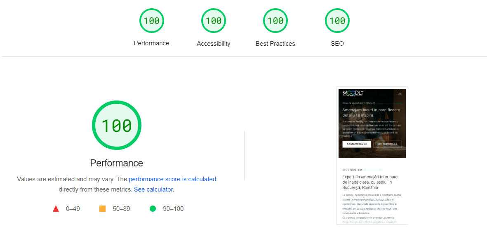
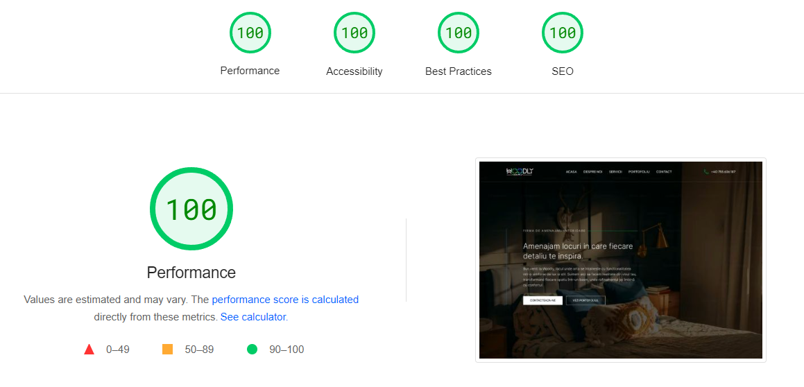
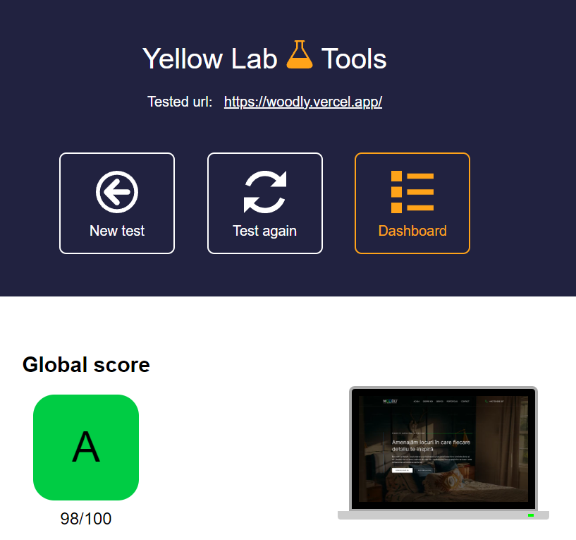

# Woodly

Created a website for an Interior Designer company's needs, focusing on simplicity and ease of maintenance for the client.

<ul>
    <li>Implemented Sanity CMS in order to allow the client to add and store content in a convenient manner.</li>
    <li>Adopted a Server-Side Generation approach to enhance the website's efficiency.</li>
    <li>Thoroughly tested the website's performance, SEO and accessibility with multiple tools.</li>
    <li>Collaborated with an UI/UX designer on creating the design for the website.</li>
</ul>

**Link to project:** https://woodly.vercel.app/

## Tech stack:

<ul>
    <li>Next.Js</li>
    <li>React</li>
    <li>TypeScript</li>
    <li>Sanity.Js</li>
    <li>Tailwind</li>
</ul>

## Test suite

<a href="https://pagespeed.web.dev/analysis/https-woodly-vercel-app/frfeife53b?form_factor=mobile" target="_blank">Google PageSpeed Insights</a>

<a href="https://yellowlab.tools/result/graz7faqxg" target="_blank">Yellow Lab Tools</a>

